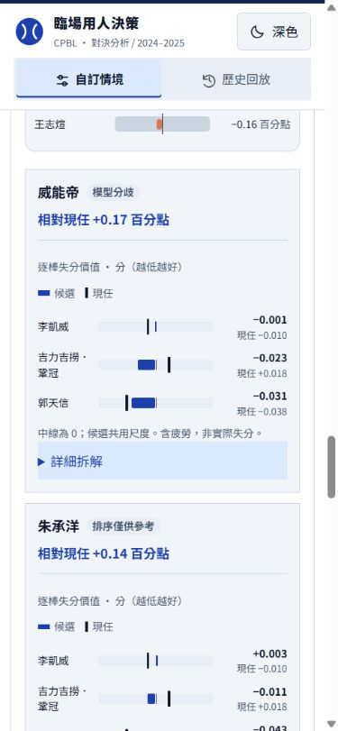
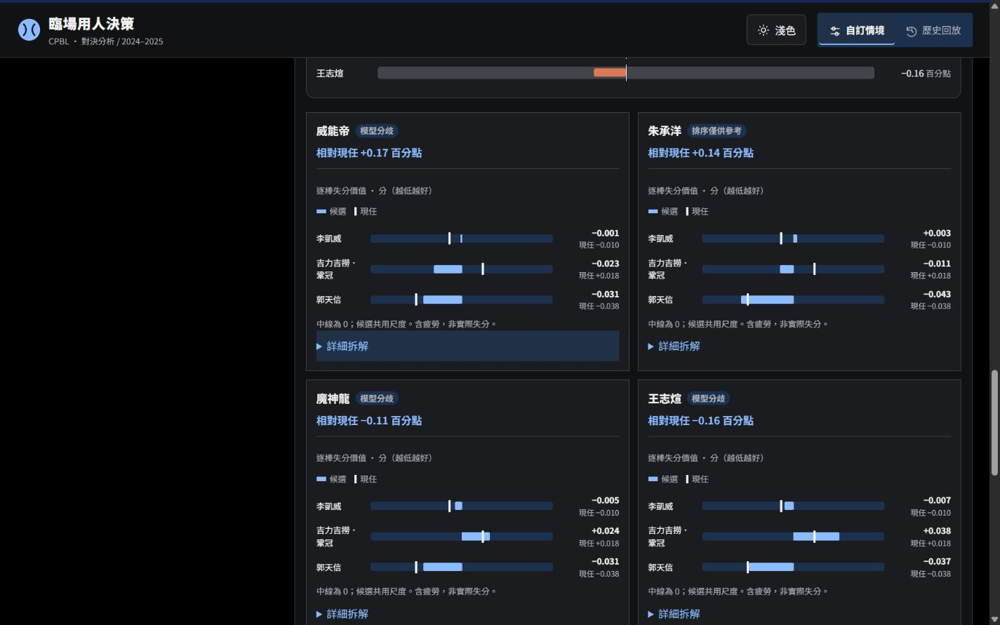

# 今日名單、現任逐棒基準與四人卡片收合

2026-10-04；僅修改前端，不改模型、疲勞公式、分數與資料。

## 完成項目

1. 群組面板直接顯示「今日勾選 N 人」及姓名；套用群組、全選／清除、手動取消與變更場上投手均刷新。常用群組與本次勾選分開，手動微調不改儲存群組。場上投手停用勾選並標示「場上」，不列入今日候選或送出名單；提醒排除休息、未登錄與已退場者。網站沒有實際登錄與退場資料，不宣稱自動判定資格。
2. 逐棒橫條加入現任直線與數字，依打者姓名配對且計入既有疲勞值。所有候選共用尺度，正負值與零點保留；現任缺值或同名資料重複時顯示未提供，不猜數值。候選橫條、現任標記有文字圖例與數字，不依賴色彩。
3. 四人比較保留姓名、差值、必要守位／疲勞警示與逐棒圖。代打的能力拆解、換投合計與模型／樣本說明移入預設收合的「詳細拆解」，手機單欄、桌面兩欄。保留四人上限与第五人移除最早選取者。

## 驗證

- JS 53／53、Python 29／29 通過；新測試檢查現任姓名配對、疲勞合计、現任缺值不猜測、其他打者不污染尺度，以及代打詳細內容預設收起。
- 實測勝投組套用後三位今日候選，取消朱承洋後即為兩位且姓名同步；場上陳冠宇停用，不計入候選。
- 四位換投卡各三棒，共 12 個現任標記，逐棒數字與現任均顯示；詳細拆解預設關閉、可展收。
- 代打四人卡的拆解關閉時不可見，開啟可見，再關閉恢復隱藏；守位說明保留在主卡。
- 320／390／1440px、深淺主題實測，無整頁或逐棒圖表溢出；已測流程主控台沒有 error／warn。

