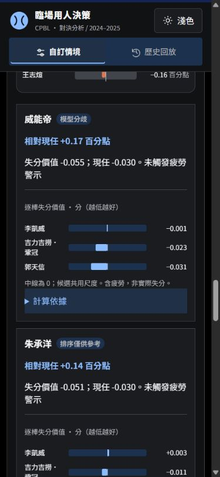
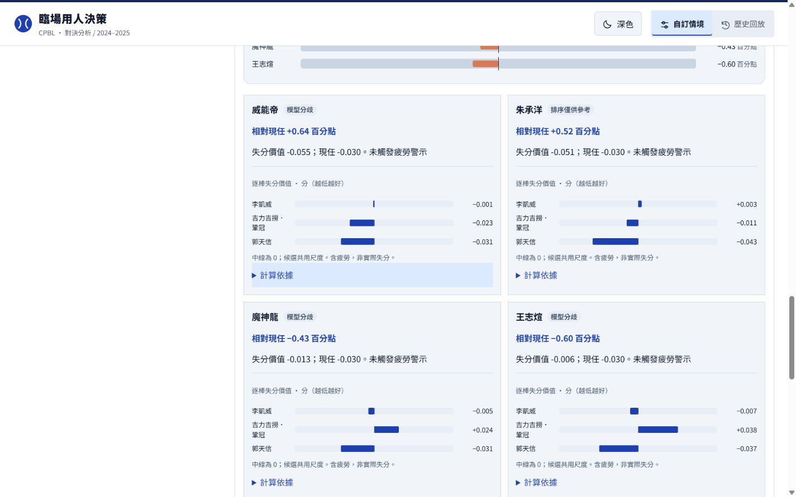

# 圖示、評估閱讀與棒球情境檢查

2026-10-04；僅前端修改，模型、分數、疲勞公式、資料與訓練保持不變。

## 修改與理由

- 評估、攻守、全選／清除加入 SVG 圖示，保留文字與可及名稱。評估完成、失敗與名單重建後恢復圖示。
- 比較卡縮短重複標籤：模型分歧、排序僅供參考；保留低樣本、差距極小、守位與疲勞警示。技術解釋留在「計算依據」內。
- 換投卡的逐棒明細改為有零點的正負橫條，候選共用尺度，顯示原始分值與疲勞合計。不是機率，負值不是負的實際失分。保留既有候選差值圖與球路比例圖；不額外做可能誤導的成功率儀表。
- 主隊在九局下或延長賽下半局已領先，阻擋下一打席评估。延長賽上半局主隊已領先的設定同樣阻擋。上下半局表示實際比賽上下，不是我方攻守。
- 延長局保留 12 局上限、二壘預設及可手動修改，出局數不強制重設。守位檢查仍是資料推估，未當成正式當日守備位置。
- 規則提醒預設收合：退場不得再上場、原棒次與 DH、新任及已上丘投手義務、例行賽延長局。換投的三棒是模型觀察範圍，未套用 MLB 三人次限制。

## 官方依據與範圍

核對對象是網站資料涵蓋的 2024–2025 一軍例行賽，未宣稱適用季後賽、二軍或 2026 新制。

- [CPBL 官方首頁規則下載入口](https://www.cpbl.com.tw/)：頁尾提供棒球規則、棒球補述及聯盟規章。
- [2025 棒球規則（官方搜尋索引）](https://cpbl.com.tw/files/file_pool/1/0p065549820043528193/2025%E6%A3%92%E7%90%83%E8%A6%8F%E5%89%87%28%E5%AE%98%E7%B6%B2%E7%94%A8%29.pdf)：搜尋索引可核對 5.10 的換人、投手義務與 5.11 指定打擊。
- [CPBL 裁判執法手冊補述（官方搜尋索引）](https://cpbl.com.tw/theme/client/download/%E8%A3%81%E5%88%A4%E5%9F%B7%E6%B3%95%E6%89%8B%E5%86%8A%E8%A6%8F%E5%89%87%E8%A3%9C%E8%BF%B0.pdf)：例行賽延長至十二局及突破僵局；搭配聯盟規章第 9 章第 37 條。

限制：本次官方 PDF 直接下載回傳 404／抓取失敗，因此依官方搜尋索引核對上述条文，不宣稱完成全冊逐條稽核。介面改放官網入口，避免把已失效 PDF 當成可用連結。現有輸入沒有完整先發／替補登錄、已退場紀錄、上丘狀態及 DH 存續；仍需教練確認，本站不能保證所有候選當下合法上場。已結束局面檢查也只在前端，不是後端規則引擎。

## 驗證

- JS 51／51，Python 29／29；包含四人上限、第五人替換、群組保存、截止日期與 18 個引擎公式回歸。
- 新測試覆蓋已結束局面不送出評估、逐棒圖正負值、缺值略過、共用尺度。
- 使用者操作：攻守評估、全選、圖示重建、計算依據展收、規則提醒展收；九局下主隊領先阻擋，調整為未結束比分可再次評估。攻守比分方向皆實測。
- 320、390、1440px／深淺色沒有整頁溢出，四候選及逐棒圖正常；已測流程主控台沒有 error／warn。

