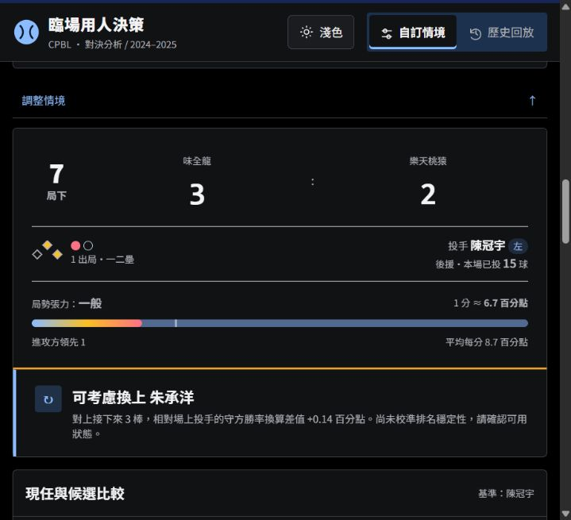

# 前端修改與驗證紀錄

日期：2026-10-04。基礎版本：主專案 main `cb24af3`。分支：`feat/frontend-refinement`。

## 修改範圍

本次整合本機既有的雙主題、情境控制、候選比較、官方球員連結與投手群組介面，再修正操作狀態與手機版。未修改 `src/`、`docs/engine.js`、模型訓練、評分公式、資料截止規則或匯出的評估資料。

- 六隊投手群組固定為勝投組、敗投組、自訂義群組。預設是依既有 2025 後援紀錄建立的可修改範本，並非官方調度分組。
- 新儲存格式容許空群組，寫入後重新讀取確認。舊資料保留；不明或損壞資料不直接覆寫。舊自訂群組可帶入自訂義群組。草稿、取消、未儲存提示與跨隊狀態分開管理。
- 編輯群組不清除現有結果；套用且實際候選改變才清除。切換對手不重設我方投手、球數與候選。
- 換投表以可鍵盤操作的選取圓鈕切換本站對決，移除「分析」文字；姓名維持 CPBL 官方資料連結。
- 代打四類守位預設收合，搜尋不取消隱藏選取，清除搜尋恢復原收合狀態。沒有守位資料的人保留顯示並標示缺漏，不創造守備資格。
- 自訂情境實際切換至 10–12 局時，只預設二壘有人，出局數不變。之後可手動改壘況；歷史回放不套用預設。延長賽仍沿用原模型，因此有短提示。
- 無效數值與重複打序有欄位標記、訊息與焦點；同條件操作與搜尋保留結果，真正變更輸入才使結果失效。非同步回應不覆蓋較新的選擇。
- 球路、近期配球及明細同步目前選取的投手與实际打者側別。缺資料時顯示缺漏；歷史明細不可回退到完整球季估計。
- 八格分類保留原比例，以線性填色呈現；微小非零比例顯示 `<1%`。高低區不是實際位置九宮格。差值單位以百分點標示。
- 深色黑底、淺色白底，一個主題切換鍵。統一文字層級、按鈕回饋、焦點與減少動態效果設定。手機比較表固定姓名欄，數據可水平捲動。
- 移除重複操作教學與技術錯誤文字；保留資料限制、守備需求及評分含義，較詳細的方法放在可展開區域。

## 自動測試

| 檢查 | 結果 |
|---|---|
| `node --test tests/*.cjs` | 46／46 通過 |
| `python -X utf8 -m unittest discover -s tests -p 'test_*.py'` | 29／29 通過 |
| 原公式回歸 | 18 個情境一致（包含於 JavaScript 測試） |

Python 測試使用既有本機逐球資料；未重新訓練、未下載或建立私人守位資料。原始資料與測試生成結果不包含在提交中。

涵蓋儲存拒絕／靜默失敗、損壞與舊格式遷移、空群組、隊別隔離、資料不足、靜態截止日期、錯誤重試、舊請求失效及主題偏好。

## 側邊瀏覽器使用者測試

- 六隊均顯示三個固定群組；編輯、切換群組、保存後重開、清空後保存與停用空群組套用正常。
- 換對手保留我方投手、球數及候選；兩隊選單避免重複隊伍。
- 自訂進攻／防守評估正常；候選投手用鍵盤 Space 選取後，明細與球路同步。
- 負分输入及重複三棒會阻擋；修正後清除錯誤標記並可重新評估。
- 延長賽預設二壘有人、保留出局數，手動清空後可評估。
- 歷史 2025-10-05 統一對中信比賽可選代打打席；代打、换投表與官方球員連結均存在，缺個人配球顯示回退提示。
- 320、390、768、1280 px 各檢查深色與淺色，共八種組合：沒有整頁水平溢出；窄版表格透過表內捲動閱覽。
- 最後自訂情境與歷史回放操作未捕捉到瀏覽器 console error／warn。

## 驗證限制與交付

瀏覽器實測是本機靜態網站與模擬視窗尺寸，沒有宣稱測過實體 iPhone／Android、Safari、實際螢幕閱讀器或完整 Python API 網頁流程。儲存群組是同一瀏覽器、同一網站來源的本機資料，不能跨裝置同步；變更 localhost 連接埠也不會共用。

依協作指南重新 clone 主專案、先 pull 最新 main、確認 PR #1 已合併，再開功能分支。推送前再次 fetch 檢查主分支；提交僅限前端、前端測試及本紀錄。PR 需另一位協作者審查，不直接推 main、不強制推送。

本分支整合前面尚未合併的前端修改；審查者應比較其他前端 PR，避免重複合併同一批內容。合併與 Pages 發布後仍需確認正式網址及該來源的群組儲存。
