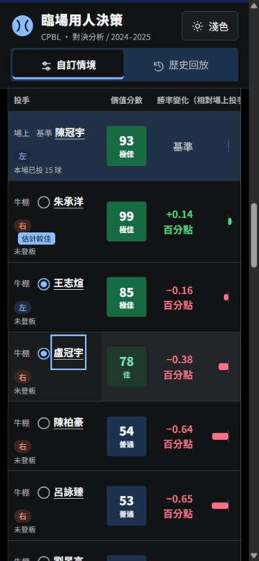
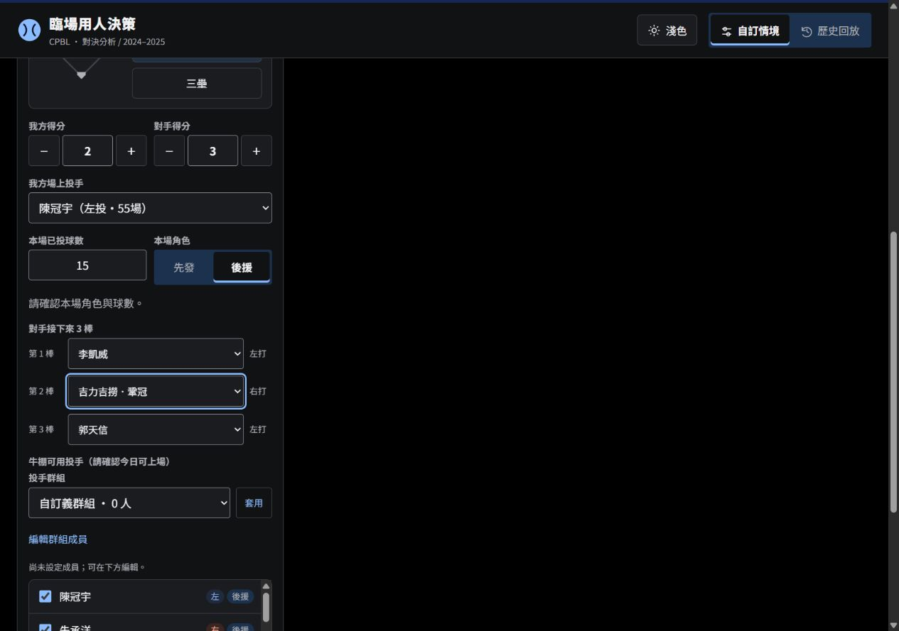

# 前端操作更新與使用者測試

日期：2026-10-04。承接 PR #9 的 `32253cd`，本次只改前端操作與排版，沒有改模型、評分公式、原始資料或資料截止規則。

## 完成內容

- 板凳可用野手增加「全部展開／全部收起」。各守位仍可單獨開啟；不更改球員勾選或清除結果。搜尋有自己的暫時收合狀態，清空搜尋恢復原本分類。
- 防守三棒改為三列完整姓名選單，左右打另列標籤。桌面 1280px 下選單由約 110px 改為約 250px，長姓名可讀。
- 代打／換投評估表移到現任與候選比較、投手球路上方，DOM 與畫面閱讀順序一致。
- 攻守最多顯示最近選取兩位候選，現任固定為基準。點第三位時移除最早的第一位，留下第二、第三位，依選取先後排列；允許取消至零或一位。
- 圓形勾選位於候選姓名前方，可鍵盤操作；加入比較同時查看該人對決。官方姓名連結維持原行為。比較、單人明細與今日可用名單分開管理。
- 移除重複的比較選人面板和代打「分析」文字，已選姓名可在比較區移除。單人查看不再將比較縮成一位。
- 主要進攻／防守及左右打切換增加短距離滑動底板；減少動態設定下取消位移。
- 手機卡片上下排列，窄桌面依結果區寬度提早改單欄；320px 差值圖將姓名分列，避免擠壓。表格保持表內水平捲動。

## 驗證結果

| 檢查 | 結果 |
|---|---|
| JavaScript `node --test tests/*.cjs` | 48／48 通過 |
| Python `python -X utf8 -m unittest discover -s tests -p 'test_*.py'` | 29／29 通過 |
| 原公式回歸 | 18 個情境一致，包含於 JavaScript 測試 |

側邊瀏覽器實際操作：

1. 全部展開、全部收起、單獨開內野；搜尋後收起符合結果，清空搜尋恢复原分類。21 名已選板凳球員保持不變。
2. 代打原兩人為廖健富、梁家榮；選何品室融後為梁家榮、何品室融，再用鍵盤選陳佳樂後為何品室融、陳佳樂。圓點、卡片與目前明細同步。
3. 換投原兩人為朱承洋、王志煊；選盧冠宇後為王志煊、盧冠宇。繼續替換及取消均正常，不重新計算評分或修改可上場名單。
4. 兩人取消至零後可重新選取；查看其他人的明細保留已選比較。展開板凳不清除已完成結果。
5. 歷史 2025-10-05 比賽選代打打席，加入林子豪後為胡金龍、林子豪。切換換投再返回代打，仍保留同一對比較候選。
6. 320、390、768、1024、1280、1440px，各檢查深淺主題，共 12 組：沒有整頁水平溢出或比較圖溢出；切換尺寸與主題保留兩位選取。
7. 另外量測防守在 320／390／1024／1280px 的三棒選單，均為三列；長姓名及左右打標籤分開顯示。最後操作未捕捉到 console error／warn。

## 限制與推送流程

實測使用本機靜態網站與模擬視窗尺寸；沒有宣稱完成實體手機、Safari、200% 瀏覽器縮放、實際系統減少動態偏好或螢幕閱讀器測試。減少動態與焦點樣式已在程式保留；正式環境仍需確認這些項目。

依協作指南沿用今日重新 clone 的主專案工作目錄。測試後再次 fetch：main 仍為 `cb24af3`，PR #9 尚未合併且分支仍為 `32253cd`，可以正常追加前端 commit。只推功能分支並更新 PR，沒有直接推 main、強制推送或自行發布 Pages。原始資料、模型及測試生成結果不提交。
