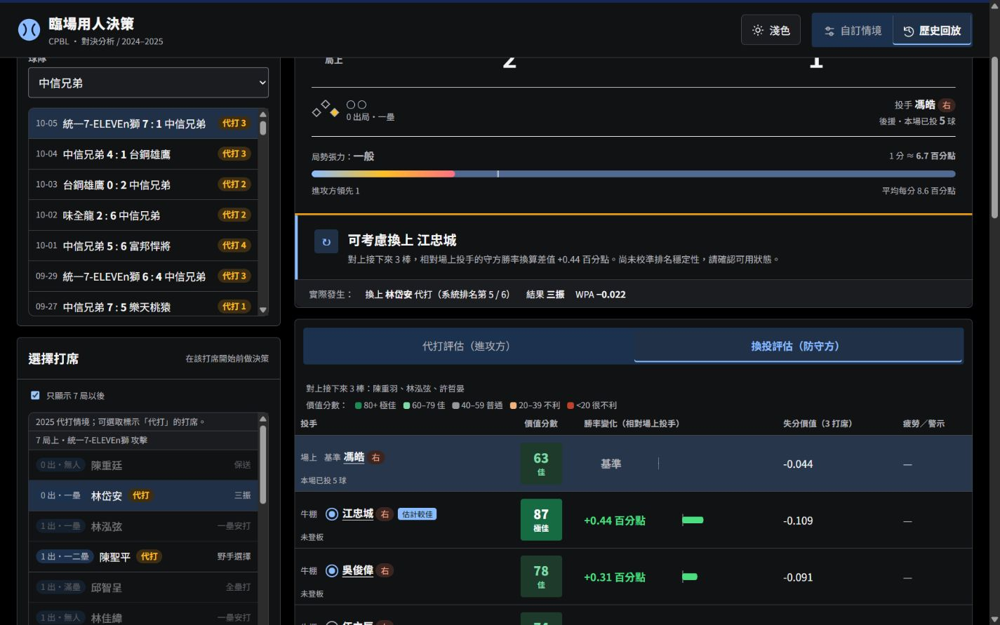
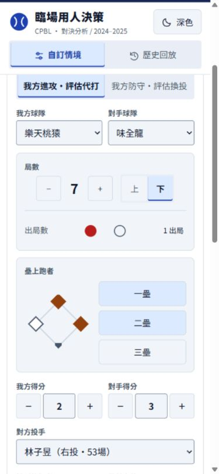

# 按鍵與切換動態更新

本次只調整前端互動，不修改模型、訓練、分數、名單或資料。

## 完成內容

- 六種兩邊式切換共用滑動選取底板：自訂／回放、進攻／防守、代打／換投頁籤、上／下半局、先發／後援、對右／左打。設定為 200ms，資料狀態立即更新。
- 歷史評估頁籤切換保留原按鈕節點及鍵盤焦點；重複點同一頁籤不重建結果。
- 一般按鍵加入短暫按壓及滑鼠移入回饋，候選圓點與壘包加入顏色過渡，展開內容加入短暫淡入。手機不依賴滑鼠懸停。
- 抑制局部選取時圖表與資料卡反覆進場，避免干擾讀值；深淺切換保留單一按鈕。
- 減少動態設定停用動畫及過渡，保留選取色與操作回饋。更新資源版本，避免載入舊版快取。

## 驗證紀錄（2026-10-04）

| 檢查 | 結果 |
| --- | --- |
| `node --test tests/*.cjs` | 48／48 通過；涵蓋選人順序、群組、主題、資料截止及既有引擎回歸 |
| `python -X utf8 -m unittest discover -s tests -p 'test_*.py'` | 29／29 通過 |
| 側邊瀏覽器實際操作 | 自訂／歷史、攻守、先發／後援、上下半局、左右打與頁籤切換正確 |
| 頁籤鍵盤與連續切換 | Space 可切換；焦點留在選取按鈕；快速來回最終狀態正確 |
| 板凳全部展開／收起 | 四組最後均收合；功能正常 |
| 響應式 | 320×740、390×844、1440×900 無整頁橫向溢出；窄頁籤文字可換行 |
| 深淺主題 | 兩種主題均實際操作 |
| 減少動態 | 瀏覽器實際偏好為 reduce，計算後的過渡時間為 0s，選取標記仍正確 |
| 瀏覽器主控台 | 已測流程無 error／warn |

測試環境預設減少動態，故已驗證停用動態的實際行為；一般模式的 200ms 動畫由 CSS 檢查確認，尚未在關閉該偏好的瀏覽器中實測流暢度。未宣稱實體手機或所有瀏覽器皆已測試。

