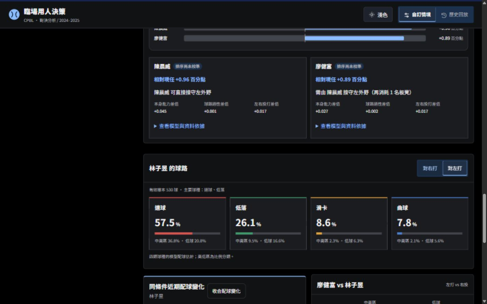

# 字級、對齊與動態驗收（2026-10-04）

## 修改

- 卡片標題 18px、卡片內次標題 16px、表單與選項標籤 14px、補充資訊 12px。同層級共用字級與行高；比分、價值分數、主視覺標題保留資訊層級。
- 板凳分類改為固定四欄：名稱、已選／總人數、箭頭、選取按鈕。按鈕固定 64px、最小高度 44px；人數靠右、名稱靠左。增加分類全選按鈕的可辨識名稱。
- 移除舊 CSS 中重複的無條件動畫停用規則。依使用者最新要求，統一開啟動態，移除動態開關；滑動 220ms、內容淡入 160ms。頁籤保留焦點與原按鈕。
- 不改模型、評分或計算。前端資源版本更新，避免舊快取。

## 使用者測試

- 在側邊瀏覽器實測滑動，取得動畫中途位移，計算過渡時間為 0.22s；球路與歷史頁籤同樣為 0.22s。環境仍採減少動態偏好，本次依明確要求以網站設定統一啟用。
- 320、390、1440px 寬度沒有整頁橫向溢出；深淺主題皆實測。分類名称、箭頭、按鈕同列對齊，人數右端一致。
- 評估結果卡片標題實測均 18px，候選與球種次標題均 16px；18 個表單標籤均 14px。
- 得分加減與手動输入、出局數、壘包、分類全選／取消、全部展收、搜尋清除恢復正常。
- 群組保存一位成員後重新載入，仍可選取「自訂義群組 · 1 人」；取消未保存修改恢復原勾選。測試後將該空白測試群組還原。
- 牛棚全選／清除／套用正常。代打與換投選第三人，勾選均保留第二、第三人，第一人移除。
- 左右打切換、配球變化展收、歷史打席及代打／換投頁籤正常；Space 切換保留焦點，連續來回切換狀態一致。
- 已測流程主控台沒有 error／warn；既有 JavaScript 48／48、Python 29／29 測試通過。

未以實體手機、Safari 或所有可能的按鍵組合進行窮舉，以上為實際完成的流程與回歸測試。

## 動畫速度更新

依使用者最新要求，所有操作過渡與進場動畫共用 `--motion-duration: 200ms`。瀏覽器實測滑動底板、按鈕、分類箭頭及主題圖示的計算時間均為 0.2s；JavaScript 48／48 測試通過。載入中的持續旋轉指示維持原有週期。

## 候選比較上限更新

換打與換投均最多四位候選，現任固定為基準，不占四人名額；預設顯示前四位可用候選。加入第五位時移除最早選取者，重複選取不改順序，取消可減少人數。更新回歸測試涵蓋兩模式、第五人替換、重複選取及新結果隔離。48 項 JS 測試通過；實際瀏覽器驗證兩模式第五人替換及取消，手機單欄、桌面兩欄、無整頁橫向溢出。模型與分數不變。
